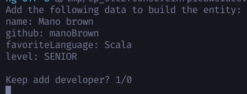
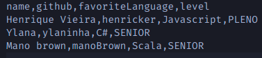
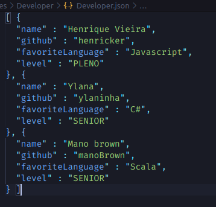
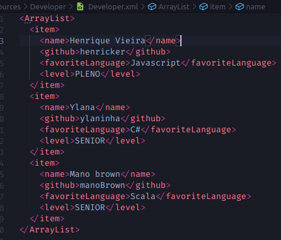

# Developers

## Sobre a atividade
  
  1. Defina uma entidade principal relacionada a um domínio de problema e crie uma classe Java para representá-la. Exemplo: Livro: isbn, titulo, editora, ano_publicacao.

  2. Crie uma classe Java para cadastrar dados relacionados à entidade definida na questão 1. A classe deve receber dados via teclado e os salvar ao final de um arquivo CSV (append).

  3. Crie uma classe Java que recebe como entrada o arquivo salvo na questão 2, lê o arquivo e o transforma em objetos Java em memória. Depois, salva os objetos em formatos XML e JSON.


## Como fiz ?

  1. Resolvi criar algo mais genérico, assim podemos mapear vários dados em json, xml e csv independente da entidade utilizada.

  2. Para que a entidade (modelo) do projeto se encaixe é necessário que possua o seguinte assinatura de construtor.

      ```java
        public SuaEntidade(Map<String, Object> data)
      ```
      Veja como exemplo o construtor da classe Developer:
      ```java
      public Developer(Map<String, Object> data) {
        this.name = String.valueOf(data.get("name"));
        this.level = Level.valueOf(String.valueOf(data.get("level")));
        this.github = String.valueOf(data.get("github"));
        this.favoriteLanguage = String.valueOf(data.get("favoriteLanguage"));
      }
      ```

      - O nosso construtor recebe um mapa de string e o valor do atributo como objeto. Assim, quando necessário basta fazer um cast, com isso o meu projeto consegue entender e enviar todos os dados para instanciar uma entidade de maneira dinâmica e independente.

  3. O projeto possui alguns Helpers que irão nos auxiliar para fazer as transformações em csv, json e xml. 
    
  - Os mapeadores em JSON e XML devem implementar o seguinte contrato, veja que também deve-se estabelecer uma tipagem para cada tipo (Classe) de entidade que formos mapear:
      ```java
      package com.project.helpers.mappers;
      import java.io.InputStream;
      import java.io.OutputStream;
      import java.util.List;

      public interface MapperContract<T extends Object> {
        public void serialization(OutputStream source, Object value) throws Exception;
        public T deserialization(InputStream source, Class<T> valueType) throws Exception;
        public void serializationAll(OutputStream source, List<T> values) throws Exception ;
        public void deserializationAll(OutputStream source, Class<T>[] valueType) throws Exception ;
      }
      ```

    - exemplo: Se você quiser mapear em JSON a alguma entidade da classe Developer basta fazer, então os métodos de serialização e desserialização irão retornar e salvar com base na nossa tipagem:
      
      ```java
        MapperContract<Developer> developerMapJSON = new MapperJSON<>();
      ```
  - Da mesma maneira que acima, a nossa classe HelperCSV também é do tipo genérica, basta passar a tipagem que ele irá salvar e carregar as entidades com base nessa tipagem.


  - Também faço o uso de uma outra clase chamada ClassUtil, ela é uma classe com alguns métodos estáticos e genéricos que podem extrair os atributos de um classType de uma entidade, extrair os valores dos atributos e também para instanciar as entidades genéricas.

4. A nossa classe de serviço é a EntityService, também genérica, com ela conseguimos fazer o append das entidades ( com base na questão 02 desse projeto) e também converter os dados salvos no csv em JSON e XML (com base na questão 03 desse projeto)
  

### Sobre como rodar e o comportamento do projeto:

  1. Para rodar a segunda questão basta ir em Solve01.java e rodar o projeto. Irá abrir a CLI no terminal pedindo os dados da entidade que está sendo utilizada (no meu caso da classe Desenvolvedor), abaixo está um exempo de como é pedido:
  
   - Para continuar cadastrando desenvolvedores basta digitar 1, caso contrário 0.
  - Quando finalizado, os dados estarão persistidos no path:   
      - resources/Developer/Developer.csv
      - Lembrando!, esses diretórios e arquivos são gerados automaticamente.
      - A abertura do arquivo csv para adicionar os desenvolvedores estão em modo append, ou seja, não há perda dos dados caso execute novamente para adicionar novos dados.
  - O exemplo a seguir mosta os dados persistidos no csv:
  
  
  2. Para rodar a terceira questão basta rodar o arquivo Solve02.java que ele irá pegar todos os dados no arquivo csv e salvar a Lista de dados em um arquivo JSON e XML.
  
  - Quando executado será criado dois arquivo JSON e XML nos seguintes paths:
    - resources/Developer/developer.xml
    - resources/Developer/developer.json
  
  - O exemplo no arquivo developer.json

    

    
  - O exemplo no arquivo developer.xml
  
    
     