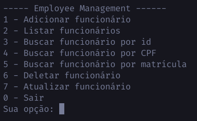

# Employee_management

## Sobre a atividade

A Lista 06 é pegar seu projeto da Lista 05 e adicionar uma implementação DAO usando JPA, como nos exemplos que disponibilizei.
Pode anotar esse novo DAO que você criar com @Repository e @Primary para que o Spring Boot disponibilize esse bean para injetá-lo como dependência à sua classe que tem o main.
Por enquanto, vamos usar o Spring Boot apenas.


## Mudança:
 - A única alteração foi criar um repositório usando JPA com hibernate e usá-la como repositório primário.
 - Veja o repositório em: `src/main/java/br/com/quixada/dspersist/employees/data/postgres/employee/EmployeeRepositoryJPAPostgres.java`

## Como fiz ?

- Utilizei uns conceitos que aprendi no trabalho, no projeto estou utilizando uma arquitetura mais limpa voltada para o domínio e as regras de negócios do sisteminha. (DDD)

- Dentro da pasta src temos as seguintes:
   
   - data => A camada onde se encontram as implementações de banco de dados e é lá onde existe a implementação JDBC de um banco postgres;
   
   - domain => A camada core, onde estão armazenados os modelos, regras de negócio e as interfaces de serviço e repositórios.
   
   - main => É a única camada onde permitimos um acoplamento, é nela onde criamos as implementações das interfaces de serviços do domain e também é responsável pela camada de UI do sistema
   
   - shared => Possui algumas classes usuais em todas as camadas como erros e outros

- O bom de usarmos uma arquitetura assim é que possamos preservar e deixar intocável todas as nossas regras de negócio e modelos!


## Sobre as funcionalidades ?

  - Um CRUD simples de funcionários;
  - No sistema você pode:
    - Criar um funcionário;
    - Listar todos os funcionários (com paginação)
      - page => página atual (inicia em 1)
      - limit => limit de funcionários por página
    - Atualizar um funcionário com base no seu id
    - Deletar um funcionário com base em seu id

## Novidades adicionadas

   - Utilizando spring boot e a API JDBC do spring
   - Adicionei validators para validar os inputs dos usuários

## Como rodar o projeto ?

 - Antes de rodar, deixei um arquivo docker-compose com as configurações de um banco postgres;

 - Caso tenha docker instalado em sua máquina rode:
  
    ```bash
      docker-compose up
    ```
    irá subir um container do postgres com o ambiente configurado para você testar

- Caso não tenha docker instalado na máquina você pode criar uma tabela "employees"
  
  - Código de criação da tabela está no diretório 
     - src/data/postgres/sql/employees.sql 

  - Adicione o seu login, senha e url em:
    - src/main/resources/application.properties

  - Código da tabela de employees
  
  

- Após isso, basta rodar a classe App.java!

## Preview das funcionalidades

### Menu principal
